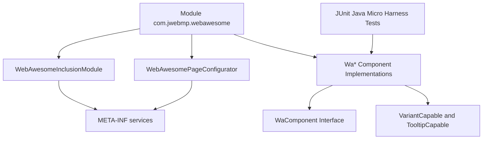

# C4 Component — WebAwesome Module

The module is organized around page configuration plus a set of component wrappers that emit WebAwesome custom elements.

## Component Notes
- `Wa*` classes extend JWebMP HTML primitives (e.g., `DivSimple`) and expose fluent setters; CRTP-style generics keep chaining type-safe.
- Enumeration types such as `Variant`, `Appearance`, `Size`, and `Placement` drive attribute rendering for custom elements.
- Tests exercise rendering and attribute mapping for representative components (buttons, inputs, overlays, layouts).

## Integration Points
- `META-INF/services` registers configurators with JWebMP runtime (`IGuiceScanModuleInclusions`, `IPageConfigurator`, `TypescriptIndexPageConfigurator`).
- CSS/JS references use `RequirementsPriority` to ensure assets load before component markup executes.
