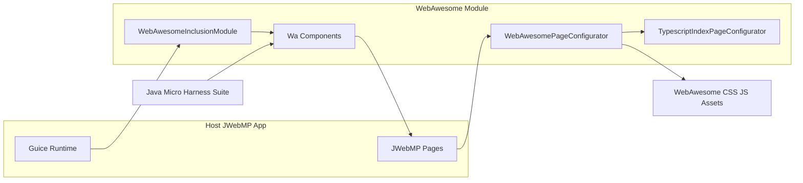

# C4 Container — WebAwesome Plugin

The plugin lives inside a single Maven module `com.jwebmp.webawesome` and plugs into the host JWebMP runtime through Guice and page configurators.

## Responsibilities
- `Configurator`: pushes CSS/JS references and theme classes into each page; injects module scripts as ES modules.
- `GuiceModule`: ensures the module is discoverable via `IGuiceScanModuleInclusions`.
- `Components`: Java wrappers (e.g., `WaButton`, `WaInput`) that render custom elements and attributes.
- `TsRegistration`: advertises the `angular-awesome` TypeScript dependency.

## External Interfaces
- CSS/JS assets served under `basePath` and `themePath` (configurable statics).
- Optional Font Awesome kit code passed via `faKitCode` attribute.
