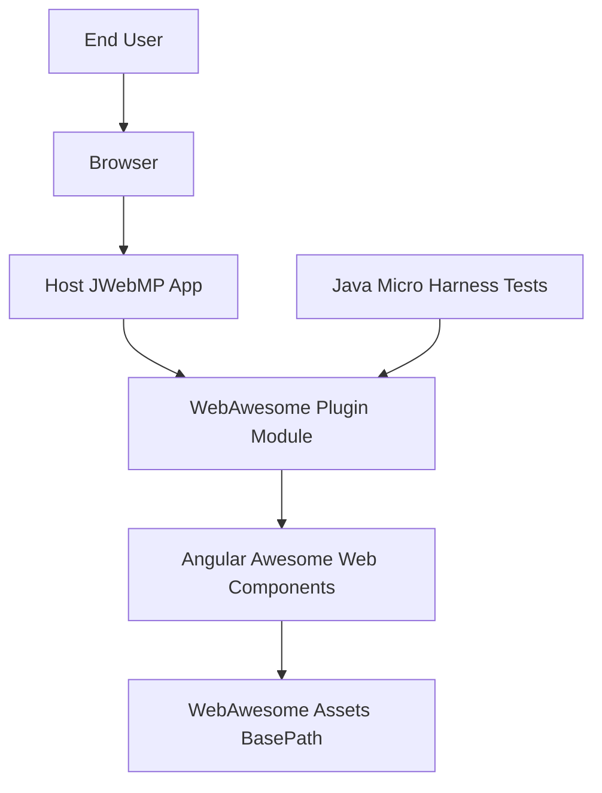

# C4 Context — WebAwesome Plugin

WebAwesome is a single Maven module that extends JWebMP pages with WebAwesome web components and associated CSS/JS assets. It runs inside a host JWebMP application and exposes components to page authors.

## Trust and Dependencies
- Host app is trusted to load assets via `WebAwesomePageConfigurator`; assets come from `basePath` and `themePath` configured in code.
- External dependency on WebAwesome distribution (CSS/JS) and Font Awesome kit when configured.
- Tests rely on `jwebmp-testlib` (Java Micro Harness) and optional BrowserStack drivers excluded by default.

## Notes
- Module registration is provided through `WebAwesomeInclusionModule` (`IGuiceScanModuleInclusions`) and `WebAwesomePageConfigurator` (`IPageConfigurator`, `TypescriptIndexPageConfigurator`).
- Forward-only: adjust diagram as new containers/services are added; do not retain deprecated nodes.
