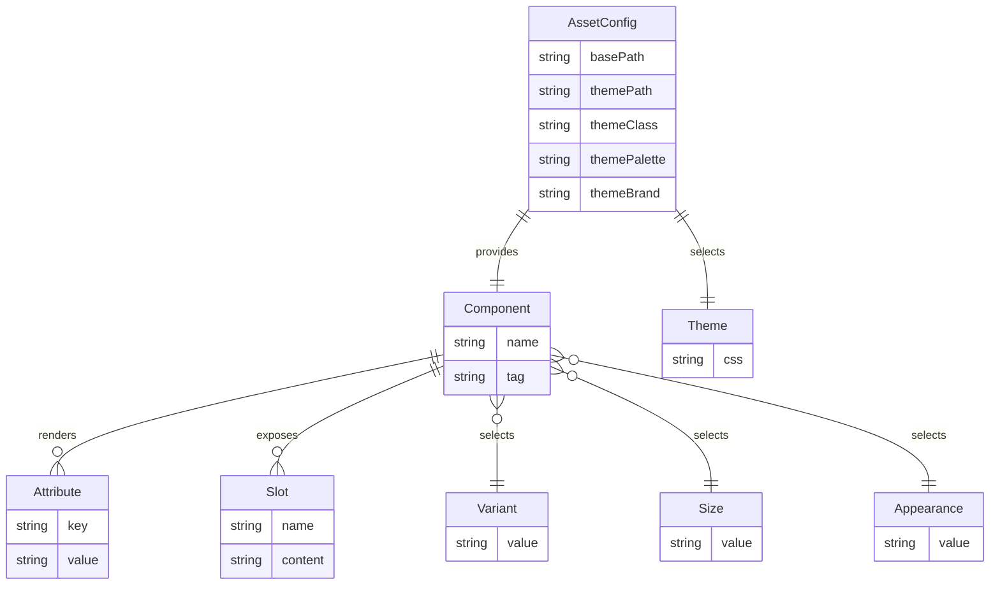

# ERD — WebAwesome Component Model

Conceptual data relationships inferred from the Java component model (no runtime database is present).

Mapping to code:
- `Component` corresponds to `Wa*` classes that render custom element tags.
- `AssetConfig` is provided by `WebAwesomePageConfigurator` static fields.
- Enumerations such as `Variant`, `Size`, and `Appearance` drive attribute selection.
- Slots map to optional prefix/suffix or child elements injected before render.
