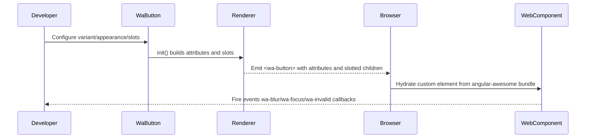

# Sequence — Component Render Lifecycle

Flow from Java instantiation to browser execution for a Wa component (example: WaButton).

Notes:
- `init()` guards against duplicate initialization and only adds attributes when set.
- Event handler attributes map directly to WebAwesome custom event names.
