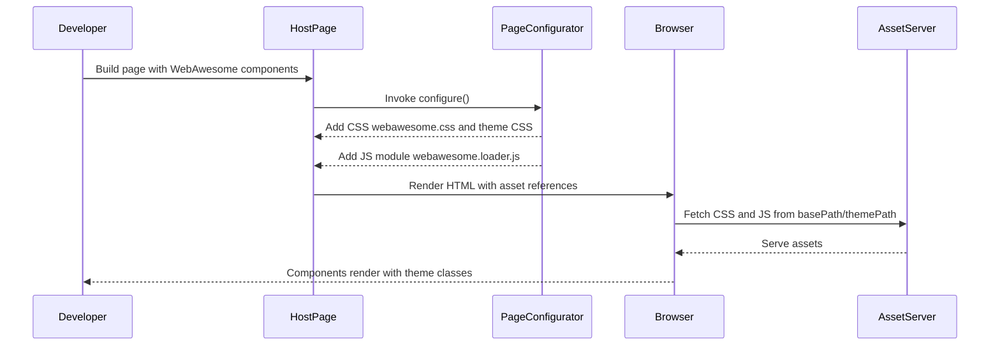

# Sequence — Page Assets Load

Sequence of how WebAwesome assets are injected into a JWebMP page.

Key trust points:
- Asset paths are provided by `basePath` and `themePath`; misconfiguration breaks styling/JS.
- Theme class names and palette names are added to `<body>` to align with CSS tokens.
